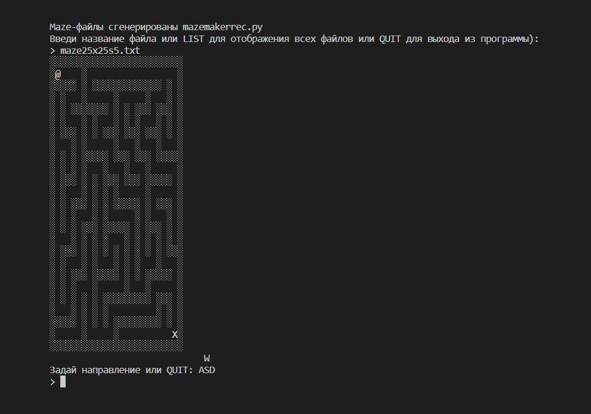

# maze-2D
 A maze that the user can navigate through using the WASD keys.

## About:
In this 2D maze game, the player sees a bird's-eye view of the maze file created in a text editor. Using the WASD keys, the player can move the @ symbol up, left, down, and right to the exit marked with the X symbol.

The program loads data about the maze walls from a text file into an associative array stored in the maze variable. The keys in this associative array are (x, y) tuples, and the values are the string values of the WALL, EMPTY, START, and EXIT constants.

 
